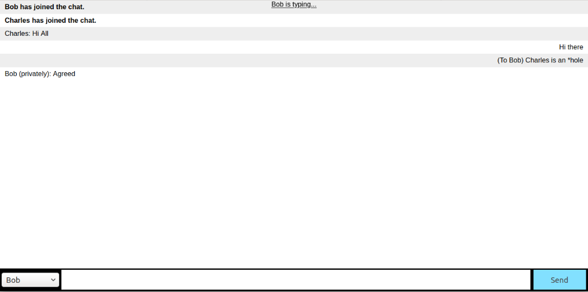

# Web Chat-room with Socket.io

Live demo deployed on [herokuapp](http://liao-tian-shi.herokuapp.com/) (Allow sometime for Dynos to start up)

A simple web-based chat room following [socket.io get-started guide](https://socket.io/get-started/chat/)
with following additional functionality implemented:
* Boardcast a message to online users when someone connected / disconnected
* Add support for nicknames
* Boardcasted message are to everyone except self
* {user} if typing functionality
* Show online players from dropdown bar at the left of textbox
* Private message to any online players in the chat room

## Dependencies
- express.js@4.17.1 (tested)
- socket.io@2.3.0 (tested)

## Build and Execute
1. Install dependencies

    npm install express
    npm install socket.io

2. Run the website at localhost

    node index.js

3. Redirect to browser http://localhost:3000/
4. Open multiple browsers / tabs, enter different nicknames
5. Start chatting~

Screenshot:

## Potential Improvement
* Username validation at server side to avoid duplicate, prevent code injection etc
* Username re-entry upon reconnection when server restarted
* Exception handling on server code to prevent shutdown
* Message-display window to auto-scrolling and not touching text-input box
* Mobile / Other resolutions compatibilities 
